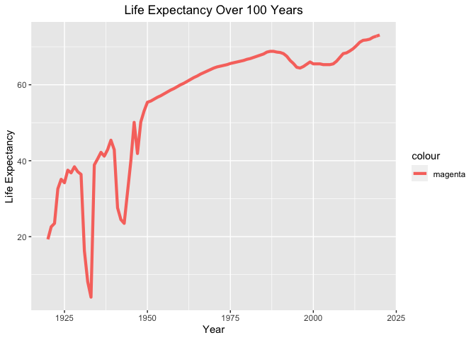
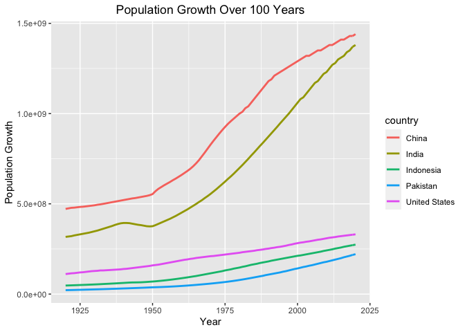

## Instructions
Answer the following questions and complete the exercises in RMarkdown. Please embed all of your code and push your final work to your repository. Your code should be organized, clean, and run free from errors. Be sure to **add your name** to the author header above. You may use any resources to answer these questions (including each other), but you may not post questions to Open Stacks or external help sites. There are 10 total questions.  

Make sure to use the formatting conventions of RMarkdown to make your report neat and clean! Your plots should use consistent aesthetics throughout.  

This exam is due by **12:00p on Tuesday, February 22**.  

## Gapminder
For this assignment, we are going to use data from  [gapminder](https://www.gapminder.org/). Gapminder includes information about economics, population, social issues, and life expectancy from countries all over the world. We will use three data sets, so please load all three as separate objects.    

1. population_total.csv  
2. income_per_person_gdppercapita_ppp_inflation_adjusted.csv  
3. life_expectancy_years.csv  


#install PACKAGES

```r
library(tidyverse)
```

```
## ── Attaching packages ─────────────────────────────────────── tidyverse 1.3.1 ──
```

```
## ✓ ggplot2 3.3.5     ✓ purrr   0.3.4
## ✓ tibble  3.1.6     ✓ dplyr   1.0.8
## ✓ tidyr   1.2.0     ✓ stringr 1.4.0
## ✓ readr   2.1.2     ✓ forcats 0.5.1
```

```
## ── Conflicts ────────────────────────────────────────── tidyverse_conflicts() ──
## x dplyr::filter() masks stats::filter()
## x dplyr::lag()    masks stats::lag()
```

```r
library(here)
```

```
## here() starts at /Users/abdelsamad/Documents/GitHub/BIS15W2022_aabdusamad
```

```r
library(paletteer)
library(naniar)
library(janitor)
```

```
## 
## Attaching package: 'janitor'
```

```
## The following objects are masked from 'package:stats':
## 
##     chisq.test, fisher.test
```

```r
library(ggplot2)
library(datasets)
```


```r
library(gapminder)
```


#DOWNLOAD THE DATA LISTED 


```r
pop_data <- readr::read_csv("data/population_total.csv")
```

```
## Rows: 195 Columns: 302
## ── Column specification ────────────────────────────────────────────────────────
## Delimiter: ","
## chr   (1): country
## dbl (301): 1800, 1801, 1802, 1803, 1804, 1805, 1806, 1807, 1808, 1809, 1810,...
## 
## ℹ Use `spec()` to retrieve the full column specification for this data.
## ℹ Specify the column types or set `show_col_types = FALSE` to quiet this message.
```

```r
anyNA(pop_data)
```

```
## [1] FALSE
```

```r
income_data <- readr::read_csv("data/income_per_person_gdppercapita_ppp_inflation_adjusted.csv")
```

```
## Rows: 193 Columns: 242
## ── Column specification ────────────────────────────────────────────────────────
## Delimiter: ","
## chr   (1): country
## dbl (241): 1800, 1801, 1802, 1803, 1804, 1805, 1806, 1807, 1808, 1809, 1810,...
## 
## ℹ Use `spec()` to retrieve the full column specification for this data.
## ℹ Specify the column types or set `show_col_types = FALSE` to quiet this message.
```

```r
anyNA(income_data)
```

```
## [1] FALSE
```
#NO NA FOUND


```r
life_data <- readr::read_csv("data/life_expectancy_years.csv")
```

```
## Rows: 187 Columns: 302
## ── Column specification ────────────────────────────────────────────────────────
## Delimiter: ","
## chr   (1): country
## dbl (301): 1800, 1801, 1802, 1803, 1804, 1805, 1806, 1807, 1808, 1809, 1810,...
## 
## ℹ Use `spec()` to retrieve the full column specification for this data.
## ℹ Specify the column types or set `show_col_types = FALSE` to quiet this message.
```


1. (3 points) Once you have an idea of the structure of the data, please make each data set tidy (hint: think back to pivots) and store them as new objects. You will need both the original (wide) and tidy (long) data!  
#PIVOT THE DATA FROM WIDE DATA INTO LONGER DATA IN ORDER TO MAKE IT MORE TIDY-ERRRRRRRRRRRRRR

#change to numeric value 

```r
pop_new <- pop_data %>%
  pivot_longer(cols = c(!contains("country")),
               names_to = "year",
               values_to = "population")
pop_new$year <- as.numeric(pop_new$year)
```


```r
income_new <- income_data %>%
  pivot_longer(cols = c(!contains("country")),
               names_to = "year",
               values_to = "gdp_pc")
income_new$year <- as.numeric(income_new$year)
```


```r
life_new <- life_data %>%
  pivot_longer(cols = c(!contains("country")),
               names_to = "year",
               values_to = "life_exp")
life_new$year <- as.numeric(life_new$year)
```


2. (1 point) How many different countries are represented in the data? Provide the total number and their names. Since each data set includes different numbers of countries, you will need to do this for each one.  

#NUMBER OF COUNRIES
#195 distinct countries 

```r
pop_new %>%
  summarize(distinct_c=n_distinct(country))
```

```
## # A tibble: 1 × 1
##   distinct_c
##        <int>
## 1        195
```

```r
income_new %>%
  summarise(distinct_c=n_distinct(country))
```

```
## # A tibble: 1 × 1
##   distinct_c
##        <int>
## 1        193
```
#193 COUNTRIES 


```r
life_new %>%
  summarise(distinct_countries=n_distinct(country))
```

```
## # A tibble: 1 × 1
##   distinct_countries
##                <int>
## 1                187
```
#183 COUNTRIES 


#NAMES OF COUNTRIES 

```r
pop_new %>%
  distinct(country)
```

```
## # A tibble: 195 × 1
##    country            
##    <chr>              
##  1 Afghanistan        
##  2 Albania            
##  3 Algeria            
##  4 Andorra            
##  5 Angola             
##  6 Antigua and Barbuda
##  7 Argentina          
##  8 Armenia            
##  9 Australia          
## 10 Austria            
## # … with 185 more rows
```


```r
income_new %>%
  distinct(country)
```

```
## # A tibble: 193 × 1
##    country            
##    <chr>              
##  1 Afghanistan        
##  2 Albania            
##  3 Algeria            
##  4 Andorra            
##  5 Angola             
##  6 Antigua and Barbuda
##  7 Argentina          
##  8 Armenia            
##  9 Australia          
## 10 Austria            
## # … with 183 more rows
```

```r
life_new %>%
  distinct(country)
```

```
## # A tibble: 187 × 1
##    country            
##    <chr>              
##  1 Afghanistan        
##  2 Albania            
##  3 Algeria            
##  4 Andorra            
##  5 Angola             
##  6 Antigua and Barbuda
##  7 Argentina          
##  8 Armenia            
##  9 Australia          
## 10 Austria            
## # … with 177 more rows
```


## Life Expectancy  

3. (2 points) Let's limit the data to 100 years (1920-2020). For these years, which country has the highest average life expectancy? How about the lowest average life expectancy?  

```r
life_new %>%
  filter(year >= 1920 & year <= 2020) %>%
  group_by(country) %>%
  summarise(average_life_exp = mean(life_exp, na.rm=T)) %>%
  arrange(average_life_exp)
```

```
## # A tibble: 187 × 2
##    country                  average_life_exp
##    <chr>                               <dbl>
##  1 Central African Republic             41.8
##  2 Mali                                 41.8
##  3 Ethiopia                             42.6
##  4 Sierra Leone                         42.6
##  5 Guinea-Bissau                        42.6
##  6 Burundi                              42.8
##  7 Malawi                               42.8
##  8 Uganda                               43.3
##  9 Eritrea                              43.4
## 10 Yemen                                43.6
## # … with 177 more rows
```


4. (3 points) Although we can see which country has the highest life expectancy for the past 100 years, we don't know which countries have changed the most. What are the top 5 countries that have experienced the biggest improvement in life expectancy between 1920-2020?  

```r
life_new %>%
  filter(between(year, 1920, 2020)) %>%
  group_by(country) %>%
  summarise(improvement_life=max(life_exp)-min(life_exp)) %>%
  arrange(desc(improvement_life)) %>%
  head(n=5, life_exp_diff)
```

```
## # A tibble: 5 × 2
##   country         improvement_life
##   <chr>                      <dbl>
## 1 Kazakhstan                  69.0
## 2 Lithuania                   63.6
## 3 Poland                      63.1
## 4 Ukraine                     62.9
## 5 Kyrgyz Republic             61.2
```


5. (3 points) Make a plot that shows the change over the past 100 years for the country with the biggest improvement in life expectancy. Be sure to add appropriate aesthetics to make the plot clean and clear. Once you have made the plot, do a little internet searching and see if you can discover what historical event may have contributed to this remarkable change.  

```r
life_new %>%
  filter(country=="Kazakhstan" & year>=1920 & year<= 2020) %>%
  ggplot(aes(x=year, y=life_exp, color = "magenta"))+
  geom_line(omega=.5, size=1.5)+
  labs(title = "Life Expectancy Over 100 Years",
       x="Year",
       y="Life Expectancy")+
  theme(plot.title = element_text(hjust = .5))
```

```
## Warning: Ignoring unknown parameters: omega
```

<!-- -->
#I'M PROBABLY WRONG BUT THE LIFE EXPECTATION DROPPED AROUND 25-35'S THROUGH ASSUMPTION THROUGH POSSIBILITIES 
*GREAT DEPRESSION
*WORLD WAR 
*SPANISH FLU(great influenza)
but at the end of the day this is only a simple conjecture not plausible information.

## Population Growth
6. (3 points) Which 5 countries have had the highest population growth over the past 100 years (1920-2020)?  

```r
pop_new %>%
  filter(between(year, 1920, 2020)) %>%
  group_by(country) %>%
  summarise(improvement_pop=max(population)-min(population)) %>%
  arrange(desc(improvement_pop)) %>%
  head(n=5, life_pop)
```

```
## # A tibble: 5 × 2
##   country       improvement_pop
##   <chr>                   <dbl>
## 1 India              1063000000
## 2 China               968000000
## 3 Indonesia           226700000
## 4 United States       220000000
## 5 Pakistan            199300000
```

7. (4 points) Produce a plot that shows the 5 countries that have had the highest population growth over the past 100 years (1920-2020). Which countries appear to have had exponential growth?  


```r
pop_new %>%
  filter(year>=1920 & year<=2020) %>%
  filter(country=="India" | country=="China" | country=="Indonesia" | country=="United States" | country=="Pakistan") %>%
  ggplot(aes(x=year, y=population, color = country))+ 
  geom_line(omega=.4, size=1)+
  labs(title = "Population Growth Over 100 Years",
       x="Year",
       y="Population Growth")+
  theme(plot.title = element_text(hjust = .5))
```

```
## Warning: Ignoring unknown parameters: omega
```

<!-- -->


## Income
The units used for income are gross domestic product per person adjusted for differences in purchasing power in international dollars.

8. (4 points) As in the previous questions, which countries have experienced the biggest growth in per person GDP. Show this as a table and then plot the changes for the top 5 countries. With a bit of research, you should be able to explain the dramatic downturns of the wealthiest economies that occurred during the 1980's.  

```r
income_new %>%
  filter(between(year, 1920, 2020)) %>%
  group_by(country) %>%
  summarise(improvement_income=max(gdp_pc)-min(gdp_pc)) %>%
  arrange(desc(improvement_income)) %>%
  head(n=5, Improvment_Income)
```

```
## # A tibble: 5 × 2
##   country              improvement_income
##   <chr>                             <dbl>
## 1 United Arab Emirates             177840
## 2 Qatar                            176920
## 3 Brunei                           163870
## 4 Kuwait                           141560
## 5 Luxembourg                        92170
```
#OIL 
#

```r
income_new %>%
  filter(year>=1920 & year<=2020) %>%
  filter(country=="United Arab Emirates" | country=="Qatar" | country=="Brunei" | country=="Kuwait" | country=="Luxembourg") %>%
  ggplot(aes(x=year, y=gdp_pc, color = country))+ 
  geom_line(omega=.4, size=1)+
  labs(title = "GDP INCOME INCREASE OVER TIME",
       x="Year",
       y="GDP")+
  theme(plot.title = element_text(hjust = .2))
```

```
## Warning: Ignoring unknown parameters: omega
```

<!-- -->


9. (3 points) Create three new objects that restrict each data set (life expectancy, population, income) to the years 1920-2020. Hint: I suggest doing this with the long form of your data. Once this is done, merge all three data sets using the code I provide below. You may need to adjust the code depending on how you have named your objects. I called mine `life_expectancy_100`, `population_100`, and `income_100`. For some of you, learning these `joins` will be important for your project.  

```r
life_expectancy_100 <- life_new %>%
  filter(year>=1920 & year<=2020)
```

```r
population_100 <- pop_new %>%
  filter(year>=1920 & year<=2020)
```


```r
income_100 <- income_new %>%
  filter(year>=1920 & year<=2020)
```


```r
gapminder_join <- inner_join(life_expectancy_100, population_100, by= c("country", "year"))
gapminder_join <- inner_join(gapminder_join, income_100, by= c("country", "year"))
gapminder_join
```

```
## # A tibble: 18,887 × 5
##    country      year life_exp population gdp_pc
##    <chr>       <dbl>    <dbl>      <dbl>  <dbl>
##  1 Afghanistan  1920     30.6   10600000   1490
##  2 Afghanistan  1921     30.7   10500000   1520
##  3 Afghanistan  1922     30.8   10300000   1550
##  4 Afghanistan  1923     30.8    9710000   1570
##  5 Afghanistan  1924     30.9    9200000   1600
##  6 Afghanistan  1925     31      8720000   1630
##  7 Afghanistan  1926     31      8260000   1650
##  8 Afghanistan  1927     31.1    7830000   1680
##  9 Afghanistan  1928     31.1    7420000   1710
## 10 Afghanistan  1929     31.2    7100000   1740
## # … with 18,877 more rows
```

10. (4 points) Use the joined data to perform an analysis of your choice. The analysis should include a comparison between two or more of the variables `life_expectancy`, `population`, or `income.`  
#Trying to group two different data then plot them on a xcatter plot graph in order to depict the relationship between population growth and country GDP?


```r
gapminder_join %>%
  filter(between(year, 1920, 2020)) %>%
  group_by(country) %>%
  summarise(pop_growthh=max(population)-min(population)) %>%
  arrange(desc(pop_growthh)) %>%
  head(n=5, pop_growthh)
```

```
## # A tibble: 5 × 2
##   country       pop_growthh
##   <chr>               <dbl>
## 1 India          1063000000
## 2 China           968000000
## 3 Indonesia       226700000
## 4 United States   220000000
## 5 Pakistan        199300000
```

```r
gapminder_join %>%
  filter(between(year, 1920, 2020)) %>%
  group_by(country) %>%
  summarise(gdp_over_time=max(gdp_pc)-min(gdp_pc)) %>%
  arrange(desc(gdp_over_time)) %>%
  head(n=5, pop_growthh)
```

```
## # A tibble: 5 × 2
##   country              gdp_over_time
##   <chr>                        <dbl>
## 1 United Arab Emirates        177840
## 2 Qatar                       176920
## 3 Brunei                      163870
## 4 Kuwait                      141560
## 5 Luxembourg                   92170
```
#THE CORRELLATION BETWEEN GDP AND POP GROWTH SHOW THAT AS GDP INCREASES OVER TIME ALONG WITH IT THE POPULATION. 


